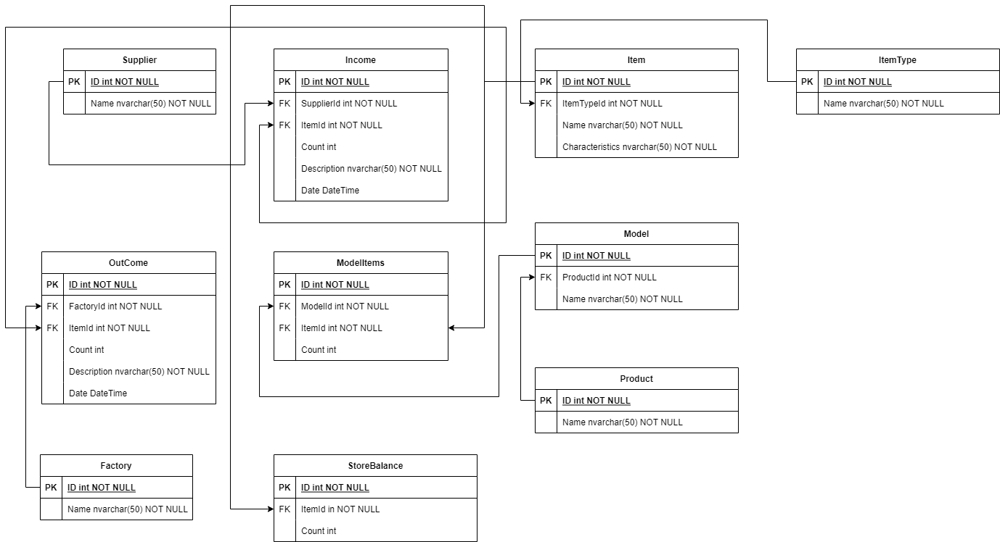
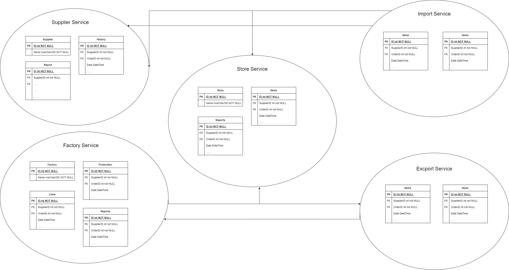

## Manufacturing compnay's Store management backend service

- Domain pure POCO classes [Bussinness domain]
- DB DataBase access layer
- Service application services layer

- **Product** table: which are products which company produces (TV, Air conditioner, washing-machine, etc)

- **Model** table: models based on products (product tv, model name 43LED)

- **ItemType** table: Items (components used for model creating) type exp: DIP, SMD, PCB BOARD

- **Item** table: Items based on item type

- **Factory** table: Companies production lines, (which components will be send to use production. [`Outcome`])

- **Supplier** table: Suppliers which delivers *items* to company [`Income`]

- **Income** table: all incomes from suppliers

- **Outcome** table: all outcomes to production lines

- **StoreBalance** table: items balance (status, how many left in the store)

## Monolithic => Microservices

In order to developing application on microservices architecture let's separate bussiness to separate services.

**Supplier Service** - consist of all supplier related services & data. Not whole, but some part of will be dependent to Store and Import services. Which makes our application more flexible

**Factory Service** - consist of all Factory related services & data. This service's some part of also will be dependent to Store and Export services.

**Store Service** - all store informations, items, reports. All local services independet, such as reports, items status, analitics etc. Will be dependent to all services needed time.

**Import Service** - all itmes import related data. Will be dependent to Store Service

**Export Service** - all items related to export data. Will  be dependent to Store Service